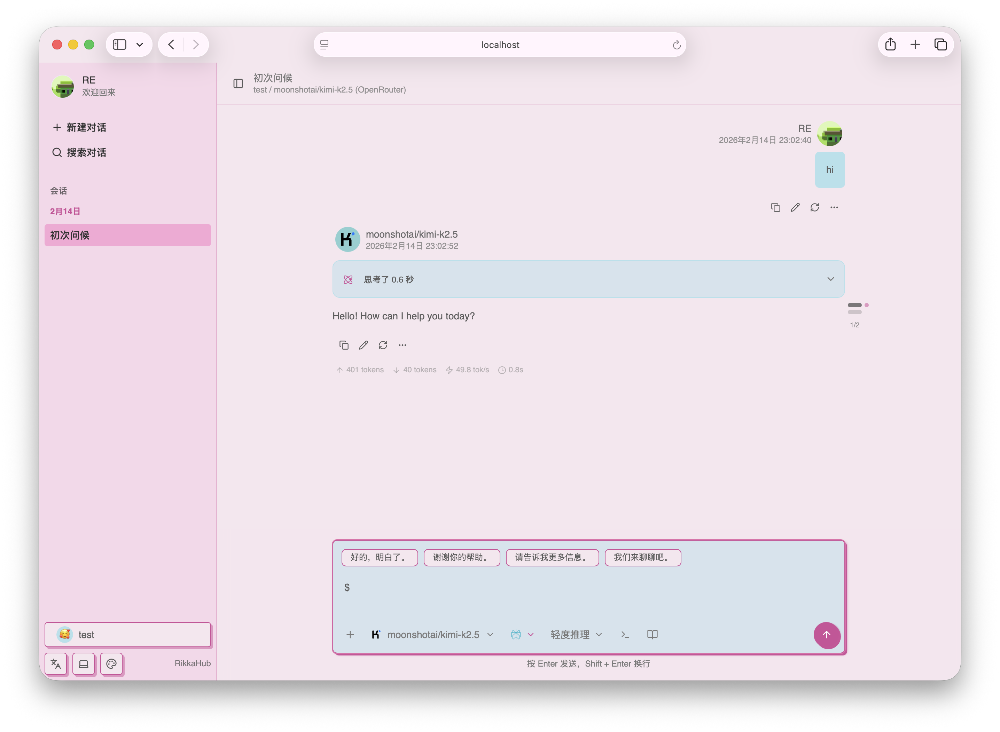

  
  <h1>RikkaHub-Lune</h1>

一個基於 RikkaHub 改名定製的原生 Android LLM 聊天客戶端，支持切換不同的供應商進行聊天 🤖💬

[English](README.md) | 繁體中文 | [简体中文](README_ZH_CN.md)

  
  

## 🔗 項目連結

- 官網占位符: [https://example.com](https://example.com)
- 當前倉庫: [https://github.com/sybdz/rikkahub-lune](https://github.com/sybdz/rikkahub-lune)
- 原項目倉庫: [https://github.com/rikkahub/rikkahub](https://github.com/rikkahub/rikkahub)

## ✨ 功能特色

- 🎨 現代化安卓APP設計（Material You / 預測性返回）
- 🌙 暗色模式
- 🖥️ Web多端訪問支持
- 🛠️ MCP 支持
- 🔄 多種類型的供應商支持，自定義 API / URL / 模型（目前支持 OpenAI、Google、Anthropic）
- 🖼️ 多模態輸入支持
- 📝 Markdown 渲染（支持代碼高亮、數學公式、表格、Mermaid）
- 🔍 搜尋功能（Exa、Tavily、Zhipu、LinkUp、Brave、Perplexity、..）
- 🧩 Prompt 變量（模型名稱、時間等）
- 🤳 二維碼導出和導入提供商
- 🤖 智能體自定義
- 🧠 類ChatGPT記憶功能
- 📝 AI翻譯
- 🌐 自定義HTTP請求頭和請求體

## ✨ 貢獻

本項目使用[Android Studio](https://developer.android.com/studio)開發，歡迎提交PR

技術棧文檔:

- [Kotlin](https://kotlinlang.org/) (開發語言)
- [Koin](https://insert-koin.io/) (依賴注入)
- [Jetpack Compose](https://developer.android.com/jetpack/compose) (UI 框架)
- [DataStore](https://developer.android.com/topic/libraries/architecture/datastore?hl=zh-cn#preferences-datastore) (
  偏好數據存儲)
- [Room](https://developer.android.com/training/data-storage/room) (數據庫)
- [Coil](https://coil-kt.github.io/coil/) (圖片加載)
- [Material You](https://m3.material.io/) (UI 設計)
- [Navigation Compose](https://developer.android.com/develop/ui/compose/navigation) (導航)
- [Okhttp](https://square.github.io/okhttp/) (HTTP 客戶端)
- [kotlinx.serialization](https://github.com/Kotlin/kotlinx.serialization) (Json序列化)
- [compose-icons/lucide](https://composeicons.com/icon-libraries/lucide) (圖標庫)

> [!TIP]
> 你需要在 `app` 資料夾下添加 `google-services.json` 檔案才能構建應用。

> [!IMPORTANT]  
> 以下PR將被拒絕：
> 1. 添加新語言，因為添加新語言會增加後續本地化的工作量
> 2. 添加新功能，這個項目是有態度的
> 3. AI生成的大規模重構和更改

## 📄 許可證

[License](LICENSE) 
